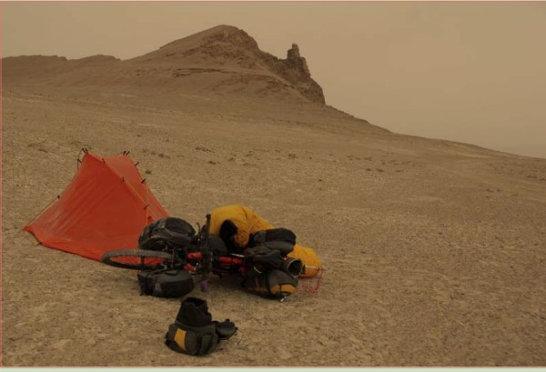
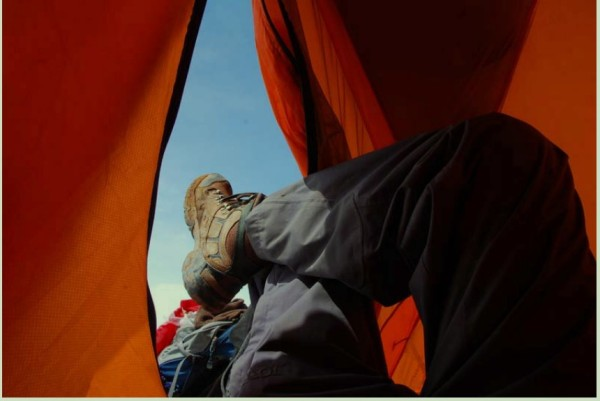
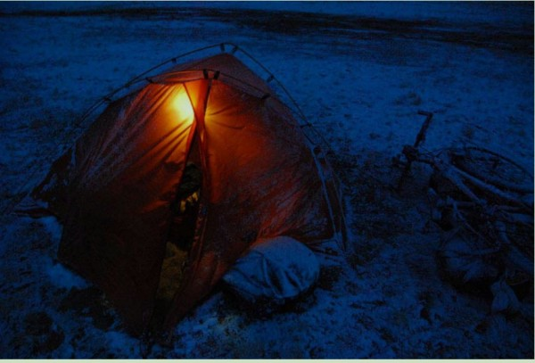
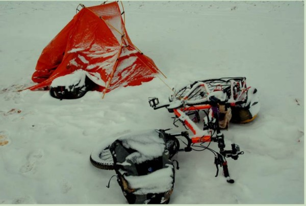
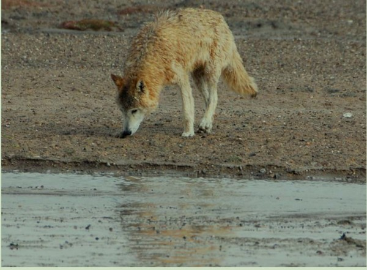
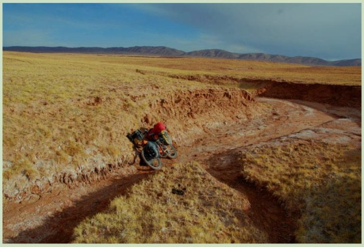

# 北方的空地

《北方的空地》

**江湖是孤独的，在于内心！**

70多天，一个人，一辆自行车（不是为了骑，是为了驮东西），横越藏北无人区。

心中有信念，看远方，有了方向，然后埋头前行。看见他所遇的艰难，需要多大的勇气，一个人是孤独的，身体在地狱、眼睛在
天堂。这是一次命运的旅途。

我曾试图理解这种恶劣的生活环境，这已是生存的极限，每天寻找水源，化雪水，吃压缩饼干...

看看自己，每当学习累的时候就想偷懒一下，可生活它不允许你偷懒，我好想激励自己再多学一点，再多学一点，北京它是一个充满希望的城市，我不希望等我老了，我回首，因为内心胆怯、懒惰、而未完成许多本应该能做到的事情。

> 以下是摘自原文的一些精彩片段

河岸沙重的超乎想象，且垂直，又卸了一次驮包才推上去。到了日落时分，天气来，霞光，蓝宇，明月……喜欢这样颜色的羌塘，喜欢这样颜色下的营地

听着音乐，抽着小烟，暂且还有愉悦的心情

入睡前风雪起，但要积到融水的厚度尚早，今夜无水无食，抽掉最后一支烟 

苦恼还是水，以为碎石山上沟壑里会有些残冰，却是碎石一片，燥风猎猎。六点在山口放眼前方，天空阴霾，风暴云游荡，山脚不远处有一个白色的湖泊，便锁定方位，抄直线下山奔去，看似咫尺，遥不可及。干涸的河道里发现一丝水痕，薄的用嘴也吸不起来，且是极碱水。又是一个奇迹，居然捡到两瓶矿泉水，生产日期 3.15 号，我怀疑是不是早前有探矿的深入羊湖一带，至少不会是近 18 天留下的，一路独我，又或许是方向一致路线有别绕到了我的前面？顾不得想那么多了。 

二十天来，奇迹遇人一小时，获三天补给，下次再遇奇迹是 53 天后了。恍然如梦，那夜羌塘风雪听见“英雄”的呼唤，今生难以忘却。就地扎营，水果狠吃一半，缓过神来，决定休息一天，太累了。

> 遇见了狼

那狼在山坡上，映着蓝天白云的感觉勾起了感悟，江湖是孤独的，在于内心。另一张照片是雪袋里混杂糌粑粉。还是欲望，对食物的失控，弄了些糌粑粉搅在装雪的袋子里，做起“糌粑冰沙”。创意无限，食物有限，不可取。

漫长的一天，筋疲力尽，这才又想起渴来，无食无水。半夜醒了几次，风沙打在帐篷上，以为是雪花。我祈祷着，下一场雪吧，给你一百块钱

