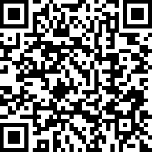
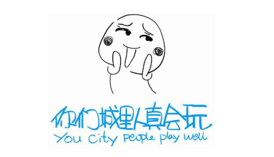
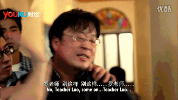

# 如何成为一个有趣的人
王小圈

> 有趣是一种态度 技术需要学习， 而态度你只需要认同， 是不是要轻松很多呢？

## 无聊是一种特权

叔本华说过刺猬困境（Hedgehog'sdilemma） ， 人跟人就像冬天里的刺猬， 围着彼此取暖又不能把彼此戳到， 所谓近之则不逊远之则怨。 随着大城市人口流动性的增加， 人与人之间的心理距离也越来越大， 后果之一便是“容易有孤独感”——每个人都是一座孤岛。 孤岛与孤岛之间缺乏深层次的沟通交流， 更易无聊。

人生三境界： 见山是山， 见山不是山， 见山还是山。

见山是山， 便是那桃花源农妇般未加雕琢的质朴本心；

见山不是山， 便是一缕聪明而又无处依托的无聊之心绪；

见山还是山， 便是接下来要探讨的主题——这个世界本来就是极有趣的， 你也是。

[无聊感倾向量表](http://read.zhiliaobang.com/static/boredom-pronenes-scale/index.html)

## “城会玩”， 玩的是什么

我热爱工作 我真的好喜欢

工作让我进步 学习让我快乐

谁需要睡觉 多么浪费时间啊

谁需要吃饭 PPT是维他命

怎么样老板 这下你满意了吧

哈哈哈哈 哈哈哈哈

辞职以后拉黑他

感觉身体被掏空 我累得像只狗

不要加班 不要加班 不要加班

……

——《我累得像只狗》 金承志 词曲

## 好奇心是源动力

你问我去过多少城市， 我告诉你很多， 但我的见识并不会比一只坐航空箱环游世界的猫更高
明。

一个人去过很多地方， 却对此无甚兴趣， 亦不求探索， 那“去很多地方”便毫无意义。

一个人看过很多书， 却对书不求甚解， 亦不做平行或纵深的比较阅读， 只是“酒肉穿肠过”般的“文字穿眼过”， 那么读书便毫无意义。

一个人交往过很多人， 却对那些人不加琢磨， 亦不追寻其内心深处的灵魂栖息地， 只看“你对我好”“你对我不够好”， 那么这段感情便毫无意义。

一个人经历过很多故事， 却对得失不做总结， 亦不追求做事精进的方法， 只把“当年我如何如何”挂在嘴边作为谈资， 那么这些故事再多也没有意义。没有探索的好奇心， 就没有经历的意义。

## 选择和什么样的人交朋友

“近朱者赤， 近墨者黑”， 看一个人是什么样的人， 就看他的朋友是什么样的人——这招在谈恋爱的时候很有用， 尤其是当你对自己眼光不甚有信心时。

交友本身是一件高成本高回报的事。 相比旅行， 交友需要付出更多的时间——这个在现代社会最珍贵的东西。

而“交男/女朋友”作为交友的进阶模式， 更是可以在两个人长时间高密度的深入沟通中交换大量的知识以及观念， 一场适可而止的恋爱， 能同时帮助双方修补不完善的人格， 使之彼此更加熟。 不过万一遇人不淑交友不慎， 学费也是巨大的。

## 世界不是平的——信息管理能力

“知道一件新鲜事”是能让人感到快乐的，我不清楚这种快乐的源泉，但我确实能感觉到。
无论是在手机上刷新闻， 还是在游戏中刷怪， 都会给人以轻松和快乐。 

在愈演愈烈的碎片化中， 我们的注意力时长渐渐变短， 在一次又一次的刷手机中， 我们不再有耐心读完一篇数万字的文章， 不再有耐心看完一堂两小时的公开课视频。 如此凶险的事实， 却很少有人意识到——我们的时间就是我们的生命。 被切割的， 不仅仅是时间， 还有生命。

## 选择与自由

我们这一代人面临了太多的选择。 选择多责任也多， 本着对自己下半辈子负责的态度， 我们艰难地为自己做决定： 

我要好好念书而不是混过高三， 我要勤勉工作而不是得过且过。 我在零度的杭州选择6点半起床， 坐在没有暖气的自习室刷一天卷子；我在22楼的深圳选择加班到凌晨四点， 只为把工作更加优化。

和那个长辈比起来， 我们这一代更自由， 也更需要担当。 大到选大学选工作选对象， 小到选菜单选电影选目的地， 我们终于可以说出自己的意愿、 表达自己的需求， 这是来之不易的自由。如果说我们花出去的每一分钱都决定了这个世界是什么模样， 那我们的每一个选择也决定了我们自己是什么模样， 以及我们自己在他人眼中是什么模样。

如果因为害怕承担责任而去做一个“随便”的人， 那一个个“随便”会让人在漫不经心中流失其独特的个人特质， 成为芸芸众生中面目模糊的剪影。

##  我打起脸来自己都怕——自嘲

自嘲是幽默的一种

自嘲需要注意“分寸”：一不可妄自菲薄，让人误以为真；二不可下手太重，伤了自己体面。

## 赞美、 倾听、 反驳——情绪沟通

沟通=语言内容+情绪。沟通一定要感知到情绪。如千万不要和你的恋人打字吵架，文字只能提供语言内容，无法提供情绪，极其容易引发误解。

- 一阵见血的赞美：懂行，夸到点子上。

- 心领神会地倾听：为对方提供情绪发泄的渠道，比赞美更简单，但也需要坚守你的善良。

邓布利多说： “决定我们成为什么人的， 不是我们的能力， 而是我们的选择。 ”这年头时间比钞票值钱， 愿意花时间听你说傻话的朋友比愿意给你发红包的人值钱——如果红包数量不大的话。

  > 生活中往往有三类人成为极

  1. 佳的倾听者：
  2. 真正懂你的密友；随叫随到的备胎；
  3. 口风很严的路人。

- 脚踏实地地反驳：因为“不是这样才反驳”，而不是看你不顺眼反驳。反驳是正确的并且反驳成功，能够给对方犹豫过后，豁然开朗心悦诚服，是种愉快的体验，打开新世界的大门。在我营造几十年的世界观里， 我坚不可破的知识和逻辑架构， 因你做出了调整， 因你， 我的世界观更完整更坚固了。

## 小众和我

>励志鸡汤文

做人要有这样的底气， 在美不美、 胖不胖、有趣不有趣这种标准不定的事情上——如果有人觉得你丑， 那一定是他没眼光， 美
丑标准自古多变；

如果大家都觉得你丑， 那是时代审美都跑偏；如果有人觉得你胖， 那一定是他没常识， 肉肉是热量的保障；

如果大家都觉得你胖， 那是大众尺度不健康；

如果有人觉得你无聊， 那一定是他没智慧，你明珠暗投；

如果大家都觉得你无聊， 那一定是群体水平低下；

只有服装店导购才能判断你美不美，

只有医生才能确诊你胖不胖，

只有你自己才知道日子过得爽不爽

